<!--
  Profile README of cesaints (github.com/cesaints/cesaints).
  The site is the single source of truth: everything here mirrors src/content/ of the portfolio
  (profile, career, stack, ladder, now). When the site changes, change this file the same day.
  Site origin: https://cesaints.vercel.app — the fallback in astro.config.mjs. If the production
  SITE_URL differs, replace it in every link below.
  Organizations, clients and cities stay unnamed on purpose (the site's rules apply here too).
-->

<a href="https://cesaints.vercel.app/en/">
  
</a>

<p align="center">
  <a href="https://cesaints.vercel.app/en/"></a>
  <a href="https://www.linkedin.com/in/carlossaints/"></a>
  <a href="mailto:cesaints.engineer@gmail.com"></a>
  <a href="https://cesaints.vercel.app/en/cv"></a>
</p>

<p align="center"><sub>Em português: <a href="https://cesaints.vercel.app/">cesaints.vercel.app</a> &nbsp;·&nbsp; Brazil · fully remote</sub></p>

## `~ % cat about.md`

In four years I went from trainee to running technology for small companies: I wrote code, designed architecture, looked after data and led delivery. In my own systems I started hunting for flaws before anyone else did, which is where my move into AppSec and pentesting comes from, without leaving development behind.

**How I work**

- **Business rules are invariants.** Money, access and personal data stay on the server, with a test that fails if the rule breaks and a review gate that can block the change.
- **A bug becomes a test before it becomes a fix.** Money and access rules are tested against a real database, and every change goes through CI before it is deployed.
- **Security in the design.** Authorization on the server and closed by default, each company's data isolated in the database itself, protections that fail closed.
- **Decisions get written down.** ADRs, with the negative consequences as well as the positive ones.
- **Proof before claims.** Numbers carry a date and a source. When I haven't verified something, I say so.

**Looking for:** AppSec and secure-development roles, junior web and API pentesting, or security-minded software engineering. Fully remote only. I also take freelance projects with a defined scope ([services](https://cesaints.vercel.app/en/services)).

## `~ % projects --featured`

Sixteen case studies on the site, each with an architecture diagram and, where there is one, a demo with fictional data. The numbers below were counted in the repositories in 2026-09 and carry their source on each case page. Client systems are described without names or URLs, on purpose.

| Case | What it proves | Stack |
|---|---|---|
| [A study platform with payments, access control and timed exams](https://cesaints.vercel.app/en/projects/study-platform) | Signed, idempotent payment webhooks with access revocation in the same transaction. Mandatory TOTP 2FA on the panel, enforced CSP, criticality-based rate limiting. 3 apps in one monorepo, 167 test files, 24 e2e specs, CI with 8 jobs. | TypeScript · Next.js · PostgreSQL · Prisma · Turborepo |
| [A security review of the business logic of my own system](https://cesaints.vercel.app/en/projects/business-logic-review) | Thirteen classes of flaws reproduced in failing tests and fixed at the narrowest boundary, never touching production. The costliest ones were concurrency and the gap between what a rule promises and what the code guarantees. | PostgreSQL (advisory locks, RLS, SKIP LOCKED) · Vitest · Playwright |
| [A multi-company onboarding platform with isolation in the database](https://cesaints.vercel.app/en/projects/multi-company-onboarding) | Row-Level Security on all 25 tables. Cross-tenant isolation and privilege-escalation suites run against the real migrations in CI. 26 decisions recorded as ADRs. | Next.js · Supabase · PostgreSQL · Vitest with PGlite |
| [This site](https://cesaints.vercel.app/en/projects/this-site) | One typed content source generates the pages, the terminal's filesystem, the command palette, the CV and `resume.json`. Everything reads without JavaScript. Hash-based CSP, and a test checks every colour pair of both themes for WCAG AA. | Astro · Preact · Vitest · Playwright + axe |
| [A corporate site and an in-house CRM at the edge](https://cesaints.vercel.app/en/projects/edge-crm) | Site, APIs and CRM in one Worker, replacing a SaaS, with cookieless privacy. Five roles on a single ladder with owner scoping. About 200 unit cases and 5 e2e suites against the built Worker. | Astro · Cloudflare Workers · D1 · R2 |
| [A national confederation's member system, modernized with the legacy still live](https://cesaints.vercel.app/en/projects/member-management) | From zero to 47 test files on a 100k-line PHP legacy. 42 versioned migrations, 214 routes with their access profiles declared on the route, deploys with backup, verification and rollback. | PHP · MySQL · Docker · GitHub Actions |

Ten more in the [archive](https://cesaints.vercel.app/en/projects). Public code here: [`nexusdata`](https://github.com/cesaints/nexusdata), an asynchronous document-processing API (FastAPI, Celery, RabbitMQ, PostgreSQL, Redis) with multi-tenant isolation, idempotency and HMAC-signed webhooks.

## `~ % stack`

Evidence-graded, as on the [site](https://cesaints.vercel.app/en/stack). **Strong** means central in a project with 50+ commits, tests, CI and deploy, or in three or more projects. **Professional** means used at work, with no public repository here.

| | Strong, with a case behind it | Moderate | Professional, at work |
|---|---|---|---|
| Languages | TypeScript · SQL (PostgreSQL, SQLite, MySQL) · JavaScript (Node.js) | PHP · Python | C# · Java |
| Frameworks | Next.js (App Router) · React · Astro · Turborepo and pnpm · Zod · Tailwind CSS | Preact | .NET and ASP.NET · Angular · Vue.js · Spring Boot |
| Data | PostgreSQL · Supabase (Auth, RLS, Storage) · Prisma · SQLite and Cloudflare D1 | MySQL and MariaDB · Redis | SQL Server · Entity Framework · Dapper · Elasticsearch |
| Auth | Custom authentication (modern hashing, opaque sessions, roles, audit trail) · Auth.js with mandatory TOTP 2FA · Multi-tenant isolation with RLS | | |
| Infra | GitHub Actions · Vercel · Cloudflare Workers (D1, R2, KV) · Gated deploys and migrations (backup, verification, rollback) | Docker and Compose | Azure DevOps |
| Tests | Vitest · Security tests (isolation, role escalation, CSP, concurrency) | Playwright | |
| Security | CSP and security headers · Criticality-based rate limiting | Business-logic security review · Privacy and LGPD in engineering | |
| AI in the product | LLM output validated by schema, with a spend cap | | |
| Process | Architecture decision records · Runbooks and operations docs | | Scrum (as Scrum Master, 2024–2025) |

## `~ % git log --graph career`

```text
* 2026-05 → now      Founder and engineer · own product, a study platform                    (HEAD)
* 2026    → now      Product and technology director (CPTO) · business group, two companies (HEAD)
* 2024-11 → now      Software engineer and DBA, freelance · national professional association (HEAD)
* 2024-04 → 2025-12  Scrum Master · software house, federal government systems
* 2023-09 → 2024-04  .NET developer · the same software house
* 2022-09 → 2023-09  Intern, then full-stack developer · the same software house
* 2022-07 → 2022-10  Trainee · PHP and Laravel to Java, Spring Boot and Angular
```

**Education:** postgraduate (lato sensu) in Process and Project Management, GRAN, 2025–2026 · postgraduate (lato sensu) in Innovation, AI and Robotic Care, GRAN, 2025–2026 · Systems Analysis and Development, UDF University Center, 2022–2024.
**Certifications:** Scrum Fundamentals Certified (SCRUMstudy) · Registered Scrum Basics (Scrum Inc.) · Six Sigma Yellow Belt.
**Award:** 2nd place, PMI-DF Hackathon, representing UDF ([verification](https://www.udf.edu.br/detalhe-noticia/?r=alunos-2lugar-hackathon-udf/)).

What each role involved, with dates: [career](https://cesaints.vercel.app/en/career) · [CV](https://cesaints.vercel.app/en/cv).

## `~ % security`

Four years of building are where the security I know how to apply comes from: authentication, data isolation, concurrency, headers, business-logic review in the systems I built. In **offensive** security I'm in training. No professional pentesting yet, no security certification and no CVE, and I won't pretend otherwise. Empty levels stay visible on purpose.

| Level | How it is proven | Today |
|---|---|---|
| 0 · Fundamentals in progress | Dated notes and platform progress | OWASP WSTG, PTES and NIST SP 800-115, with dated notes in the [journal](https://cesaints.vercel.app/en/security/journal) |
| 1 · Guided practice | Writeups of retired content, with the builder-side fix | — |
| 2 · Own project | A tool or lab with public code | — |
| 3 · External validation | A certification with a verification link, a CTF scoreboard | — |
| 4 · Authorized real world | A disclosure-program report, a CVE with a vendor advisory | — |
| Cross-cutting, from building | Security applied to systems I built | A business-logic review with thirteen classes of flaws fixed · cross-tenant isolation and role-escalation tests running in CI · enforced CSP, rate limiting and mandatory 2FA in production |

Next on the [roadmap](https://cesaints.vercel.app/en/security/roadmap): a sample report from the review of my own system, PortSwigger Web Security Academy labs logged in the journal, retired Hack The Box machines with writeups and the builder-side fix, then a hands-on entry certification (eJPT or DCPT). Authorized targets only, and nothing published before coordinated disclosure: [rules of engagement](https://cesaints.vercel.app/en/security/rules).

## `~ % now` <sub>2026-09-24</sub>

- Studying web security testing methodology with OWASP WSTG, PTES and NIST SP 800-115.
- Building [the site](https://cesaints.vercel.app/en/colophon), with its decisions and tests on record.
- Looking for an AppSec or junior pentest role, without leaving development.

## `~ % contact`

- **Roles and projects:** the [contact form](https://cesaints.vercel.app/en/contact) or cesaints.engineer@gmail.com. Fully remote only (home office).
- **LinkedIn:** [in/carlossaints](https://www.linkedin.com/in/carlossaints/)
- **Found a flaw in the site?** [security.txt](https://cesaints.vercel.app/.well-known/security.txt). I'll reply, fix it and credit you if you want.
- **Languages:** Portuguese (native) · English (technical reading and writing)

<p align="center"><sub><code>carlos@cesaints ~ %</code> &nbsp;Numbers carry a date and a source. When I haven't verified something, I say so.</sub></p>
